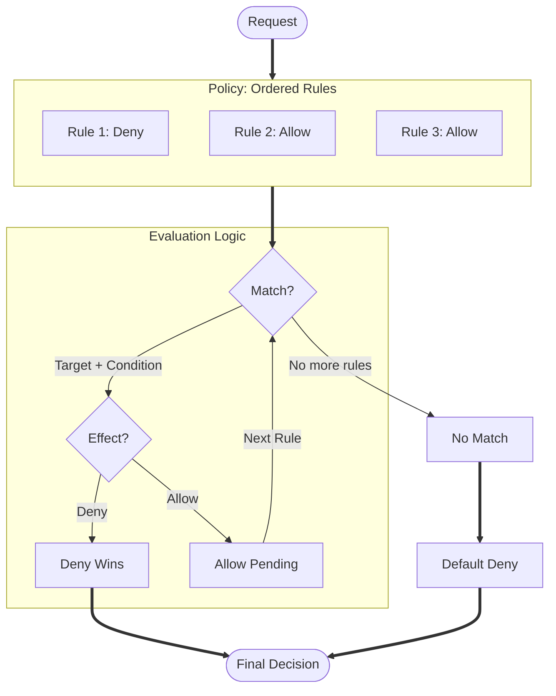

# 🎨 policy.rs

> A small, auditable, terminating, deterministic micro-policy engine.


[](https://sonarcloud.io/summary/new_code?id=yonasBSD_policy.rs)
[](https://sonarcloud.io/summary/new_code?id=yonasBSD_policy.rs)
[](https://sonarcloud.io/summary/new_code?id=yonasBSD_policy.rs)
<!--[](https://codecov.io/gh/yonasBSD/policy.rs)-->
<!--[](https://github.com/yonasBSD/policy.rs/pkgs/container/policy.rs)-->
<!--[](https://hub.docker.com/r/policy.rs/example)-->
<!--[](https://quay.io/repository/policy.rs/example)-->


[](https://deps.rs/repo/github/yonasBSD/policy.rs)

[](https://github.com/yonasBSD/policy.rs/releases/latest)
[](https://github.com/yonasBSD/policy.rs/blob/main/LICENSE.txt)
<!--[](https://matrix.to/#/#vaultwarden:matrix.org)-->

## Security Model

policy.rs (based on [Gate0](https://github.com/Qarait/gate0)) is designed for high-assurance environments where policy evaluation must be deterministic and resource-bounded. See [SECURITY.md](SECURITY.md) for the full threat model, system invariants, and mechanical guarantees.

## Architecture

policy.rs uses a linear, **Deny-Overrides** evaluation strategy. Each rule consists of a **Target** (fast-path match) and an optional **Condition** (deep logic).



## Verification

The correctness and safety of policy.rs are mechanically verified:

- **Unit Tests**: Full coverage of core logic and edge cases.
- **Property-Based Testing**: Hundreds of adversarial scenarios generated via `proptest`.
- **Undefined Behavior Check**: Verified panic-free and UB-free using `cargo miri`.
- **Bounded Evaluation**: Worst-case inputs are tested to ensure termination.

```bash
cargo test
cargo +nightly miri test --lib
```

## Example

```rust
use policy_rs::policy::{Policy, ReasonCode, Request, Rule, Target};

let policy = Policy::builder()
    .rule(Rule::allow(Target::any(), ReasonCode(1)))
    .build()?;

let decision = policy.evaluate(&Request::new("alice", "read", "doc"))?;
assert!(decision.is_allow());
```

## Examples

The `examples/` directory contains illustrative scenarios demonstrating common policy.rs usage patterns:

- **SaaS API**: Standard RBAC/Multi-tenancy logic.
- **Zero Trust Network**: Attribute-Based Access Control (ABAC) with MFA and location checks.
- **Complex Overrides**: Demonstrating Deny-Overrides conflict resolution.

Run them with:
```bash
cargo run --example simple
cargo run --example simple-with-logger
```

## License

MIT
